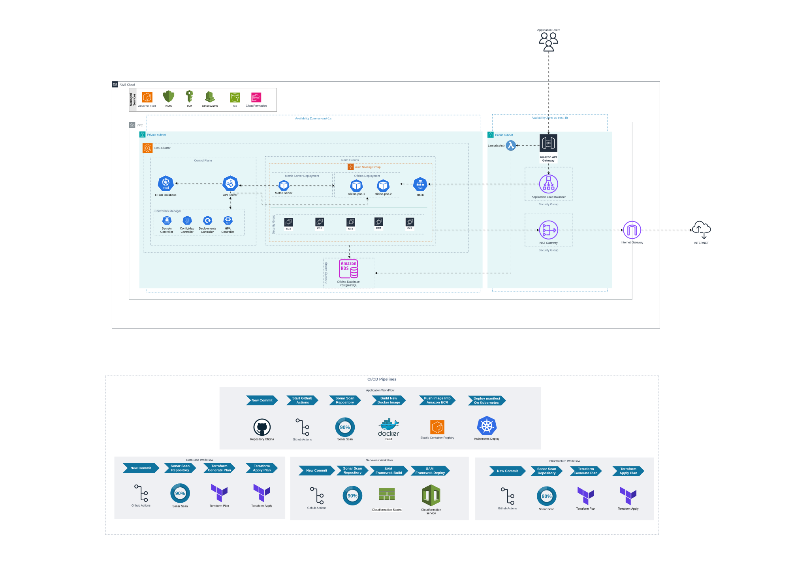

# Oficina Infra

## Visão Geral

Este projeto implementa uma arquitetura completa e moderna na AWS utilizando **Terraform** para provisionamento de infraestrutura como código (IaC), **Amazon EKS** (Elastic Kubernetes Service) para orquestração de containers, e um pipeline **CI/CD** totalmente automatizado com **GitHub Actions**.

A solução foi desenvolvida seguindo as melhores práticas de DevOps, segurança e escalabilidade, com análise contínua de código via **SonarCloud** e deploy automatizado em múltiplos ambientes (dev, hom, prod).

## Diagrama da Arquitetura



## Infraestrutura

### Pré-requisitos

- **Terraform**: v1.14.2+
- **AWS CLI**: v2.0+
- **kubectl**: v1.28+
- **Conta AWS** com permissões adequadas
- **AWS Credentials** configuradas (via `aws configure` ou variáveis de ambiente)

### Arquitetura de Módulos

#### 1. **VPC Module** (`modules/vpc`)
Provê toda a infraestrutura de rede isolada:
- **VPC** com CIDR 10.0.0.0/16
- **2 Subnets públicas** (uma por AZ) - para NAT Gateways e Load Balancers
- **2 Subnets privadas** (uma por AZ) - para EKS Nodes e RDS
- **Internet Gateway** - conectividade externa
- **2 NAT Gateways** - alta disponibilidade para saída de tráfego das subnets privadas
- **Route Tables** - roteamento configurado automaticamente

#### 2. **KMS Module** (`modules/kms`)
Gerencia criptografia de dados sensíveis:
- Chave KMS para criptografia de **secrets do EKS**
- Alias `{cluster-name}-eks` para fácil identificação
- Janela de deleção configurável (padrão: 30 dias)

#### 3. **IAM Module** (`modules/iam`)
Gerenciamento de permissões e roles:
- Utiliza **LabRole** existente para cluster EKS e worker nodes
- Suporte para anexar políticas AWS gerenciadas (quando permitido)
- Políticas customizadas para casos específicos
- Princípio de menor privilégio aplicado

#### 4. **EKS Cluster Module** (`modules/eks-cluster`)
Cluster Kubernetes gerenciado:
- **EKS Control Plane** com Kubernetes 1.33
- **Security Groups** para cluster e comunicação com nodes
- **CloudWatch Logs** para API, Audit, Authenticator, Controller Manager, Scheduler
- **Endpoint público** com CIDRs configuráveis
- **Criptografia de secrets** habilitada com KMS
- Retenção de logs configurável (padrão: 7 dias)

#### 5. **Node Group Module** (`modules/node-group`)
Worker nodes gerenciados:
- **Instâncias**: t3.medium (configurável)
- **AMI**: Amazon Linux 2023 (AL2023_x86_64_STANDARD)
- **Capacity Type**: ON_DEMAND (ou SPOT para economia)
- **Auto Scaling**: 1 (min) → 2 (desired) → 4 (max) nodes
- **Disk**: 20 GB gp3 por node
- **Labels Kubernetes** customizados para workload placement
- SSH opcional via EC2 Key Pair

#### 6. **ALB Module** (`modules/alb`)
Application Load Balancer para distribuição de tráfego:
- **Load Balancer**: Internet-facing, ouvindo na porta 80
- **Target Group**: Redirecionamento para NodePort (30007) nos worker nodes
- **Segurança**: Security Group permitindo acesso HTTP externo
- **Regras de Listener**: Bloqueio de acesso direto, permitindo apenas requisições com o header `X-Service-Token` correto

#### 7. **API Gateway Module** (`modules/api-gateway`)
Ponto de entrada único e seguro para a aplicação:
- **REST API**: Configurado via OpenAPI (`oficina.yaml`)
- **Integração**: HTTP Proxy com o ALB
- **Segurança**: Injeção automática do secret `X-Service-Token` em todas as requisições para o ALB
- **Deploy**: Stages automatizados (dev, hom, prod)


### Configuração por Ambiente

A infraestrutura suporta múltiplos ambientes através de arquivos de variáveis em `infra/inventories/{env}/terraform.tfvars`:

| Ambiente | Diretório | Descrição | Recursos |
|----------|-----------|-----------|----------|
| **dev** | `inventories/dev/` | Desenvolvimento | Recursos mínimos, deletion_protection=false |
| **hom** | `inventories/hom/` | Homologação | Configuração similar a produção |
| **prod** | `inventories/prod/` | Produção | Alta disponibilidade, backups, proteção |

### Comandos Terraform

```bash
# Navegar para o diretório de infraestrutura
cd infra/

# Inicializar o Terraform
terraform init

# Validar a configuração
terraform validate

# Planejar mudanças (dev)
terraform plan -var-file=inventories/dev/terraform.tfvars

# Aplicar infraestrutura (dev)
terraform apply -var-file=inventories/dev/terraform.tfvars

# Ver outputs da infraestrutura
terraform output

# Destruir infraestrutura (cuidado!)
terraform destroy -var-file=inventories/dev/terraform.tfvars
```

## Estrutura do Projeto

```
fase-2-oficina/
│
├── .github/                          # Automação e CI/CD
│   └── workflows/
│       └── ci-cd.yml                 # Pipeline: SonarCloud → Terraform
│
├── infra/                            # Infraestrutura como Código (Terraform)
│   ├── modules/                      # Módulos reutilizáveis
│   │   ├── vpc/                      # Rede (VPC, Subnets, NAT, IGW)
│   │   ├── kms/                      # Chaves de criptografia
│   │   ├── iam/                      # Roles e políticas IAM
│   │   ├── eks-cluster/              # Cluster Kubernetes
│   │   ├── node-group/               # Worker Nodes
│   │   ├── alb/                      # Application Load Balancer
│   │   └── api-gateway/              # API Gateway REST API
│   │
│   ├── inventories/                  # Configurações por ambiente
│   │   ├── dev/                      # Desenvolvimento
│   │   ├── hom/                      # Homologação
│   │   └── prod/                     # Produção
│   │
│   ├── main.tf                       # Orquestração dos módulos
│   ├── variables.tf                  # Variáveis
│   ├── outputs.tf                    # Outputs
│   ├── provider.tf                   # Provider AWS
│   └── backend.tf                    # Backend S3
│
└── sonar-project.properties          # Configuração do SonarCloud
```

## Observabilidade (Datadog)

O cluster EKS é monitorado pelo **Datadog Agent** instalado via Helm chart (`k8s/datadog/values.yaml`). A configuração habilita:

- **APM** — Coleta de traces das aplicações no cluster
- **Logs** — Agregação automática de logs de todos os containers
- **Orchestrator Explorer** — Visibilidade sobre pods, deployments e demais recursos Kubernetes
- **Cluster Agent** — Réplicas com PodDisruptionBudget para alta disponibilidade

A API key é gerenciada via Kubernetes Secret (`datadog-secret`), referenciada no values.

## CI/CD Pipeline

### Pipeline GitHub Actions

O pipeline é acionado em:
- **Push** na branch `main`
- **Pull Requests** em qualquer branch
- **Repository Dispatch** (tipo: `deploy-application`)

### Jobs do Pipeline

#### **1. sonar-scan**
Análise de qualidade e segurança do código:
- **Ferramenta**: SonarCloud
- **Configuração**: `sonar-project.properties`

#### **2. terraform-plan**
Planejamento da infraestrutura:
- **Dependência**: sonar-scan
- **Passos**:
  1. Checkout do código
  2. Setup do Terraform (v1.14.2)
  3. Configuração de credenciais AWS
  4. `terraform fmt -check` (validação de formatação)
  5. `terraform init` (inicialização)
  6. `terraform validate` (validação sintática)
  7. `terraform plan` (planejamento)
  8. Upload do plano como artefato

#### **3. terraform-apply**
Aplicação da infraestrutura:
- **Dependência**: terraform-plan
- **Condição**: Apenas na branch `main`
- **Environment**: dev (ou conforme input)
- **Passos**:
  1. Download do plano gerado
  2. `terraform apply` (aplicação automática)
  3. Extração dos outputs (nome do cluster)

#### **4. datadog-deploy**
Deploy do Datadog Agent no cluster EKS:
- **Dependência**: terraform-apply
- **Condição**: Apenas na branch `main`
- **Passos**:
  1. Configuração de credenciais AWS e kubeconfig
  2. Instalação do Helm e adição do repositório Datadog
  3. Criação do namespace `datadog` e Secret com a API key
  4. `helm upgrade --install` do agent usando `k8s/datadog/values.yaml`
